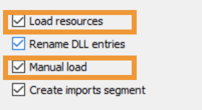

# IDA2Obj

__IDA2Obj__ is a tool to implement __SBI (Static Binary Instrumentation)__. 

The working flow is simple:

- Dump __object files (COFF)__ directly from one executable __binary__.
- __Link__ the __object files__ into a new binary, almost the same as the old one. 
- During the dumping process, you can __insert any data/code at any location__.
  - __SBI__ is just one of the using scenarios, especially useful for black-box fuzzing.

## How to use

1. Create a folder as the workspace.

2. Copy the target binary which you want to fuzz into the workspace.

3. Load the binary into IDA Pro, choose __Load resources__ and __manually load__ to load __all__ the segments from the binary.

   

4. Wait for the auto-analysis done.

5. Dump object files by running the script `MagicIDA/main.py`.

   - The output object files will be inside `${workspace}/${module}/objs/afl`.
   - If you create an empty file named `TRACE_MODE` inside the workspace, then the output object files will be inside  `${workspace}/${module}/objs/trace`.
   - By the way, it will also generate 3 files inside  `${workspace}/${module}` :
     - exports_afl.def       (used for linking)
     - exports_trace.def  (used for linking)
     - hint.txt                     (used for patching)

6. Generate lib files by running the script `utils/LibImports.py`.

   - The output lib files will be inside `${workspace}/${module}/libs`, used for linking later.

7. Open a terminal and change the directory to the workspace.

8. Link all the object files and lib files by using `utils/link.bat`.

   - e.g. `utils/link.bat GdiPlus dll afl /RELEASE`
   - It will generate the new binary with the pdb file inside  `${workspace}/${module}`.

9. Patch the new built binary by using `utils/PatchPEHeader.py`.

   - e.g. `utils/PatchPEHeader.py GdiPlus/GdiPlus.afl.dll`
   - For the first time, you may need to run  `utils/register_msdia_run_as_administrator.bat` as administrator.

10. Run & Fuzz.

## More details

Repo Link: https://github.com/jhftss/IDA2Obj (private now, will be open source after the IDA plugin contest)

__HITB__ : https://conference.hitb.org/hitbsecconf2021sin/sessions/ida2obj-static-binary-instrumentation-on-steroids/

__Slides__ : https://github.com/jhftss/IDA2Obj/blob/main/rsrc/HITB2021SIN%20-%20IDA2Obj_Static%20Binary%20Instrumentation%20On%20Steroids.pdf

__Demo__ : https://drive.google.com/file/d/1N3DXJCts5jG0Y5B92CrJOTIHedWyEQKr/view?usp=sharing

